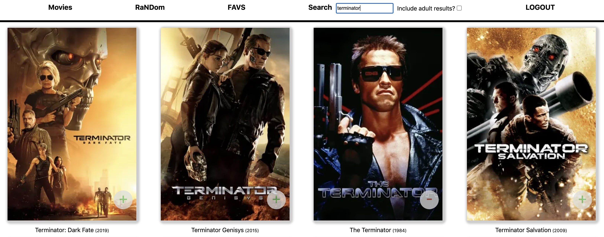
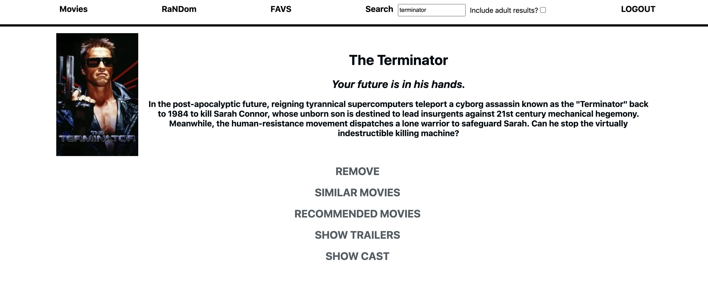

# MyFlix

MyFlix is a NextJS app to discover and organize films.

## Installation

First you need the [backend](https://github.com/alexbujenita/flix-node-back)

Make sure you have NodeJS > 10 installed, (tested on v14).

Clone the repo and install the dependencies:

```
yarn
```

and then run it in development mode:

```
yarn dev
```
or better yet build it and run the faster prod build:

```
npx next build
npx next start
```

Navigate to localhost:3000/movies and enjoy.

## Tech info
- Lazy loaded and cached images
- Cookies for auth
- Server side rendered with static pages like the auth ones
- React Hooks for state and component "lifecycle"

## Features
- Film browser and search functionality
- Account creation
- List of personal favourites
- Recommendations and similar films based on a film
- Display the cast of a film
- Display the trailers of a film
- Actors Info and their filmography
- Random films based on year and rating

## Screenshots



