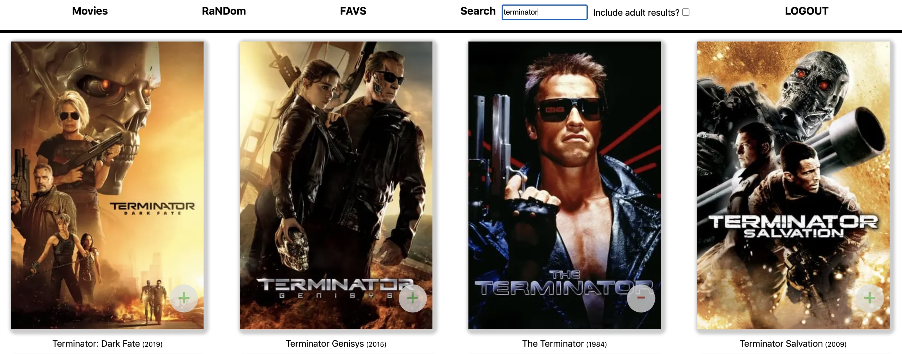
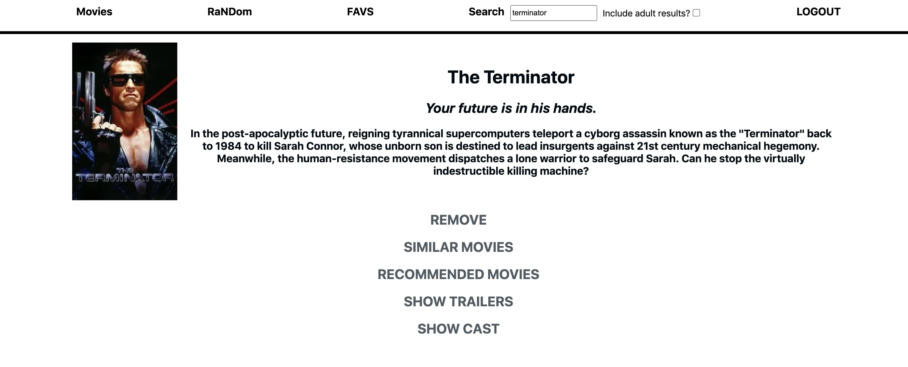
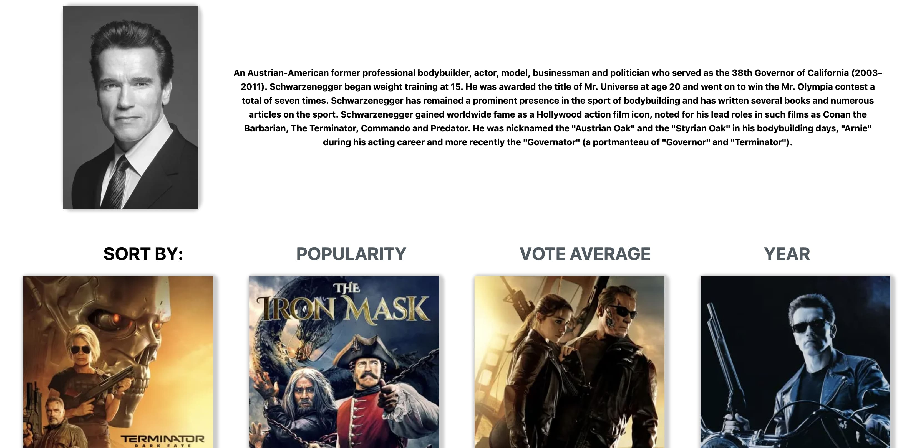

# MyFlix

MyFlix is a NextJS app to discover and organize films.

## Installation

First you need the [backend](https://github.com/alexbujenita/flix-node-back)

This project requires Node.js `^24.15.0 || >=26.0.0` (Node 24.15+ on the 24 LTS line, or Node 26+).

After cloning, run `yarn build` once to generate `.next/types/`, which is required for `yarn typecheck` to work correctly.

Clone the repo and install the dependencies:

```
yarn
```

and then run it in development mode:

```
yarn dev
```

or better yet build it and run the faster prod build:

```
npx next build
npx next start
```

Navigate to localhost:3000/movies and enjoy.

## Testing

### The stack

| Tool                         | Why it's here                                                                                     |
| ---------------------------- | ------------------------------------------------------------------------------------------------- |
| Vitest 4.1                   | Test runner. Shares Vite's transform pipeline, so JSX and ESM work with no extra Babel config.    |
| Testing Library (React) 16.3 | Renders components and queries them the way a user would, by role and text rather than internals. |
| MSW 2.15                     | Intercepts HTTP at the network layer, so axios calls are exercised for real instead of stubbed.   |
| next-router-mock 1.x         | Stands in for the Next.js router, which is otherwise unavailable outside a running app.           |
| jsdom 30                     | The DOM implementation the tests run against.                                                     |

### Running the tests

```
yarn test        # run the suite once
yarn test:watch  # re-run on change
yarn coverage    # run with a V8 coverage report
yarn typecheck   # type-check the suite against tsconfig.vitest.json
```

Run `yarn build` once after cloning. It generates `.next/types/`, which `yarn typecheck` needs.
The project supports Node `^24.15.0 || >=26.0.0`.

### Coverage baseline

| Metric     | Baseline |
| ---------- | -------- |
| Statements | 84.04%   |
| Branches   | 68.9%    |
| Functions  | 76.51%   |
| Lines      | 84.39%   |

Baseline recorded at time of writing. Run `yarn coverage` for current numbers. There are no
coverage thresholds; the report is informational.

### Conventions

Full detail lives in [tests/README.md](./tests/README.md). The short version:

- **Never assert on CSS class names.** CSS modules are stubbed, so the generated names mean
  nothing. Query by role, label, or text.
- **Build props with the fixture factories** in `tests/fixtures/`, such as `makeMovie` and
  `makePerson`. Override just the field under test. Partial object literals won't type-check
  against components that destructure their parameters.
- **No blanket `as any` and no `@ts-ignore`.** A narrow `// @ts-expect-error` is allowed at two
  named render sites only, each covering a known JSDoc defect in the source.

### Tests lock current behavior

These tests describe what the app does today, not what it should do. When a test surfaces a bug,
record it in [docs/TEST-BUGS.md](./docs/TEST-BUGS.md) and write the test to match the existing
behavior. Don't fix the bug as part of writing the test. Changing `src/` to make a test pass
defeats the point of having a baseline.

## Tech info

- Lazy loaded and cached images
- Cookies for auth
- Server side rendered with static pages like the auth ones
- React Hooks for state and component "lifecycle"

## Features

- Film browser and search functionality
- Can search for actors
- Account creation
- List of personal favourites
- Download a PDF document with the favourites
- Recommendations and similar films based on a film
- Display the cast of a film
- Display the trailers of a film
- Actors Info and their filmography
- Random films based on year and rating

## Screenshots




